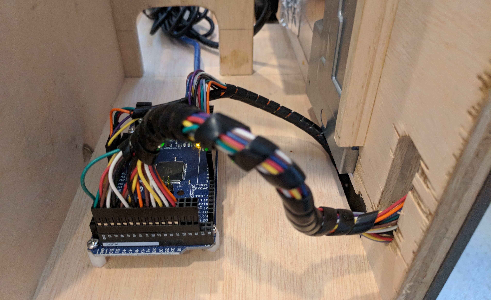

# Cessna 172 Skyhawk Flight Simulator Panel
This repository contains drawings, 3d models, laser-cutting templates, and code artifacts that were created to build a Cessna 172 Skyhawk flight simulator panel. The content here primarily serves as a means to organize and document the project and some basic assembly instructions are provided.

This project is a work in progress and components will be added as construction progresses.

## Goal

My goal is to build a reasonably priced, desk-mounted, fully functional flight simulator panel that I can use as a training device in conjunction with real-world flight training.

In addition to using for flight training, building my own panel was a good excuse to start a new hardware project, add some new tools to my workbench (laser cutter), and learn more about aircraft subsystems and components along the way.

## Project Status

As of November 2017, the panel is in a flyable state with a fully operating [instrument panel](./instrument_panel), [switch panel](./switch_panel), [throttle/mixture controls](./throttle_mixture_panel), [flap control](./flap_control_panel), and [yoke](./yoke_mount). Next up: the [avionics stack](./avionics)!

## Requirements

### Tools

The panel frame is constructed from plywood and requires basic woodworking tools. A table saw and miter saw simplify the construction but a jig saw should suffice for most cuts.

Many of the panel components are **3d printed** and/or **laser cut/engraved** and you would need both to build according to the instructions provided here.

For the 3d printer, I am using the [Monoprice Select Mini 3d Printer (v2)](http://amzn.to/2yNIe8t). The Select Mini has been an excellent, cost-effective printer and has worked very well for this project.

For the laser cutter, I am using a [K40 laser cutter](http://ebay.to/2kDLgY0) that I have customized for my purposes (air assist, z-adjustable bed, laser alignment/focus guide, fence etc.). A laser cutter is very useful for making panels as it can be used for both precision cutting and engraving. 

### Software

#### 3d Printed Parts

I use [FreeCAD](https://www.freecadweb.org/) for modeling parts for 3d printing and I have included the original FreeCAD (`.FCStd`) files in this repo. The FreeCAD models have been exported to STL files (`.stl`) for direct usage in slicers.

#### Laser Cut/Engraved Parts

I use [Inkscape](https://inkscape.org/en/) for modeling parts for laser cutting and engraving. I control the laser cutter with the excellent [K40 Whisperer](http://www.scorchworks.com/K40whisperer/k40whisperer.html) control software created by ScorchWorks.

## Panel Components 

### Frame

The frame provides the structure for the panel and was designed to be easily mounted and removed from my desk (1 1/8" thick). The frame is made with 1/2" inch plywood.

To simplify the construction of the instrument panel, I used a 23-inch LCD display that is masked by an [instrument panel](#instrument-panel) that houses the hardware controls for interacting with the rendered instruments.

The physical dimensions of the display required some adjustments from the actual layout of a Cessna 172  but I have attempted to keep the dimensions as close to actual as possible. The panel is about 6 inches narrower than an actual Cessna panel to save space.

The shaft of the yoke moves parallel to the desk surface just below the LCD monitor and just above the surface of the desk. This keeps the yoke reasonably close to the correct height from the top of the glareshield and allows me to fit a mostly unmodified CH Eclipse yoke into the panel.

The portion of the frame below the desk surface houses the switch panel, throttle/mixture controls, flaps controls, and trim wheel.

For parts and construction details see the [frame](./frame) directory.

### Yoke Mount

The yoke mount allows a [CH Eclipse Yoke](http://amzn.to/2oves8J) to be securely attached to the panel and allows the entire panel to be detached from the desk without disassembly. The mount allows the yoke to be lower than it would be if mounted directly to the desk and puts the yoke the correct distance away from the panel.

For parts and construction details see the [yoke_mount](./yoke_mount) directory.

### Instrument Panel

I opted to build a "steam gauge" panel to be able to train with traditional instruments. I may build a glass version later (X-Plane 11.10 provides a G1000) but that will require some additional reconfiguration beyond just the instrument panel.

The instrument panel is constructed from 1/4" inch birch plywood with cutouts for mounting instrument bezels and hardware. The panel is attached directly to the frame with truss-head screws.

The instruments are rendered with [Air Manager](https://www.siminnovations.com/).

For parts and construction details see the [instrument_panel](./instrument_panel) directory.

### Avionics

Work in progress. I'm planning on building out a fully simulated avionics stack to match that found in the X-Plane default Cessna 172. I plan on making the avionics modular so that I can swap out various configurations later.

For parts and construction details see the [avionics](./avionics) directory.

### Switch Panel

The switch panel houses a custom-built spring-return key switch, simulated fuses, and toggle switches for the electrical buses, fuel pump, lighting, pitot heat, and avionics. 

The switch panel is made from laser-engraved, painted white acrylic. The panel is attached directly to the frame with truss-head screws.

For parts and construction details see the [switch_panel](./switch_panel) directory.

### Throttle/Mixture Panel

The throttle/mixture panel houses real Cessna 172 throttle and mixture controls (yes, I cheated but I didn't like any of the solutions I came up with for building a functioning Vernier mixture control and I wanted to the throttle and mixture to have an accurate feel).

The throttle/mixture panel is made from laser-engraved, painted white acrylic. The panel is attached directly to the frame with truss-head screws.

For parts and construction details see the [throttle_mixture_panel](./throttle_mixture_panel) directory.

### Flap Control Panel

The flap control panel houses a custom-built electronic flap control with a flap indicator that shows the position of the flaps in the simulator.

For parts and construction details see the [flap_control_panel](./flap_control_panel) directory.

### Trim Wheel

Work in progress. This will "hang" below the panel and will also house the fuel selector valve and fuel cut-off switch. The height of my desk doesn't allow the fuel selector valve to be floor-mounted like it normally would be so I will be making some compromises on layout here.

## Input/Output

The panel was originally designed for use with [FSUIPC-supported](http://www.schiratti.com/dowson.html) simulators ([FSX](http://store.steampowered.com/app/314160/Microsoft_Flight_Simulator_X_Steam_Edition/), [Prepar3d](https://www.prepar3d.com/)) but I moved to [X-Plane 11](http://www.x-plane.com/) as my simulator of choice part way through the build process. As a result, most of the code artifacts provided here are specific to X-Plane 11.

I am using the excellent [ArdSimX Interface](http://simvim.com/ardsimx/) for interfacing Arduino Mega hardware with X-Plane. 

For details see the [io](./io) directory.

