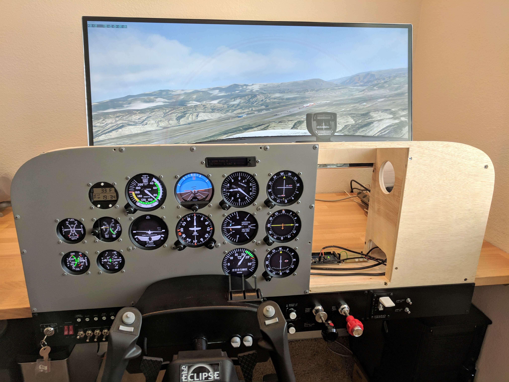

# Cessna 172 Skyhawk Flight Simulator Panel

 

I’m building a desk-mounted Cessna 172 flight simulator instrument panel for use as a training device in conjunction with real-world flight training. 

For details visit the project site at [https://cessna172sim.allanglen.com](https://cessna172sim.allanglen.com)

## License

Copyright 2018 Allan Glen

Licensed under the Apache License, Version 2.0 (the "License"); you may not use this file except in compliance with the License. You may obtain a copy of the License at

> <http://www.apache.org/licenses/LICENSE-2.0>

Unless required by applicable law or agreed to in writing, software distributed under the License is distributed on an "AS IS" BASIS, WITHOUT WARRANTIES OR CONDITIONS OF ANY KIND, either express or implied. See the License for the specific language governing permissions and limitations under the License.