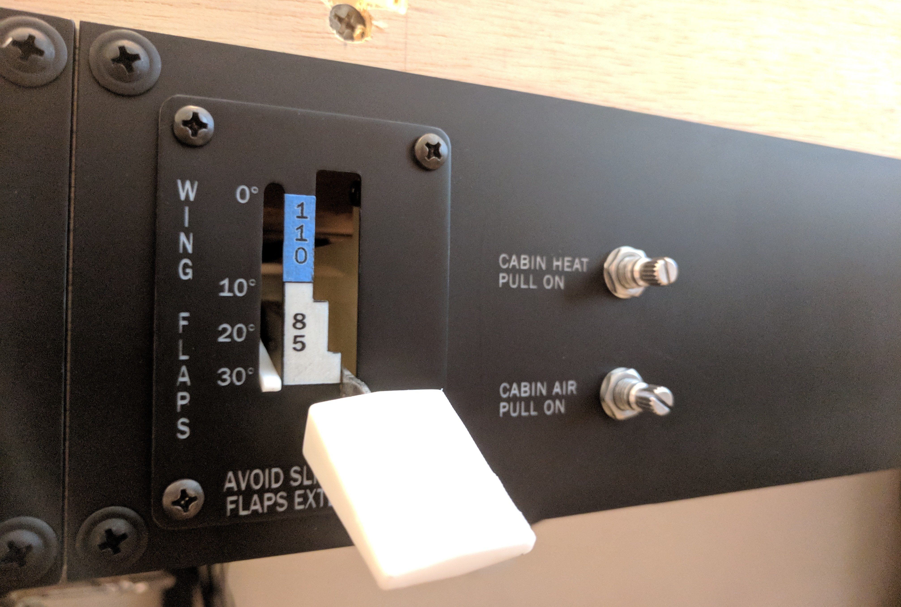
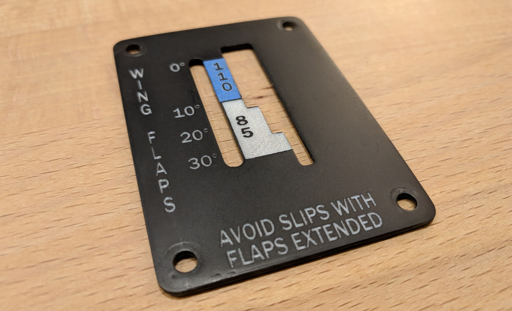

# Flap Control Panel

The flap control panels houses a custom-built electronic flap control and the cabin heat and cabin air switches.

The flap control assembly includes a servo-actuated flap position indicator that tracks the position of the flaps in the sim.

## Panel

The panel is laser cut from white acrylic, painted black, and then laser engraved. The panel is attached directly to the frame with truss-head screws.

## Flap Control

The flaps control is constructed from a combination of 3d printed and laser-cut parts and uses a genuine Cessna 172 flaps lever that I found for cheap on eBay.

### Frame

The frame provides the structure for the assembly and the mounts for the electrical components.

The sides of the frame were cut from acrylic to reduce construction time but the side panels could also be 3d printed. I have included .stl files for the frame sides if you choose to print them. 

I used 25mm M3 nylon hex spacers to secure the frame sides at the rear of the assembly.

#### Frame Left Panel

The left side of the frame is used to mount the servo for the flaps position indicator.

`flap_frame.left.svg`

`flap_frame_left.stl` (https://www.thingiverse.com/thing:2722523)

#### Frame Right Panel

The right side of the frame is used to mount the potentiometer to which the position indicator is attached.

`flap_frame_right.stl` (https://www.thingiverse.com/thing:2722523)

#### Frame Mounting Bracket

The mounting bracket attaches to the frame sides with screws and provides holes for mounting the face plate.

`flap_frame_mounting_bracket.stl` (https://www.thingiverse.com/thing:2722523)

#### Lever Mount

The lever mount secures the flap lever to the potentiometer.

I used a spring between the potentiometer nut and the lever and a second adjustable spring-tensioned screw to keep lateral pressure on the handle in all positions. The curve in the mount allows the handle to move laterally without binding.

`flap_lever_mount.stl` (https://www.thingiverse.com/thing:2722523)

### Face Plate

The face plate is 3d printed using white PLA, painted black, and then laser engraved. The face plate is used to mount the assembly to the panel and is attached to the frame mounting bracket with pan head screws.

`flap_faceplate.stl` (https://www.thingiverse.com/thing:2722523)

I used blue painters tape (didn't have any paint the correct color) to indicate the maximum flap speed and I laser engraved the tape and lettering in a single pass.

`flap_faceplate.svg`

### Flap Handle

The flap handle is a 3d printed from white PLA and threads onto the flap lever.

`flap_handle.stl` (https://www.thingiverse.com/thing:2722523)

### Position Indicator

The flap position indicator is 3d printed from white PLA and is attached to the servo motor.

`flap_position_indicator.stl` (https://www.thingiverse.com/thing:2722523)

## Cabin Heat/Air Knobs

Work in progress.

## Parts List

| Component                                | Part                                     | Quantity | Source                 |
| ---------------------------------------- | ---------------------------------------- | -------- | ---------------------- |
| Panel                                    | 3/16" bright white cast acrylic          | 282x89mm | http://ebay.to/2Bn1CMs |
| Screws (for attaching panel to frame)    | \#8 x 3/4" Phillips Truss Head Screws    | 4        | http://amzn.to/2zjDXx6 |
| Screws (for attaching frame mounting bracket) | M3 x 8mm Hex Socket Head Self-Tapping Screws | 6        | http://amzn.to/2B0ZE3B |
| Flap assembly frame spacers              | M3 25mm female nylon spacers             | 2        |                        |
| Flap assembly Screws (for attaching flap control face plate) | \#6-32 x 1/2" Philips Pan Head Screws    | 4        | http://amzn.to/2D7ipUl |
| Tension spring for flap lever mount      | 7/32" x 11/16" Comp Spring               | 1        | http://amzn.to/2BzLGct |
| Potentiometer shaft spring for flap lever | 3/8" x 5/8" Comp Spring                  | 1        | http://amzn.to/2BzLGct |
| Flap position indicator servo            | SG90 Micro Servo                         | 1        | http://amzn.to/2Da6KnA |