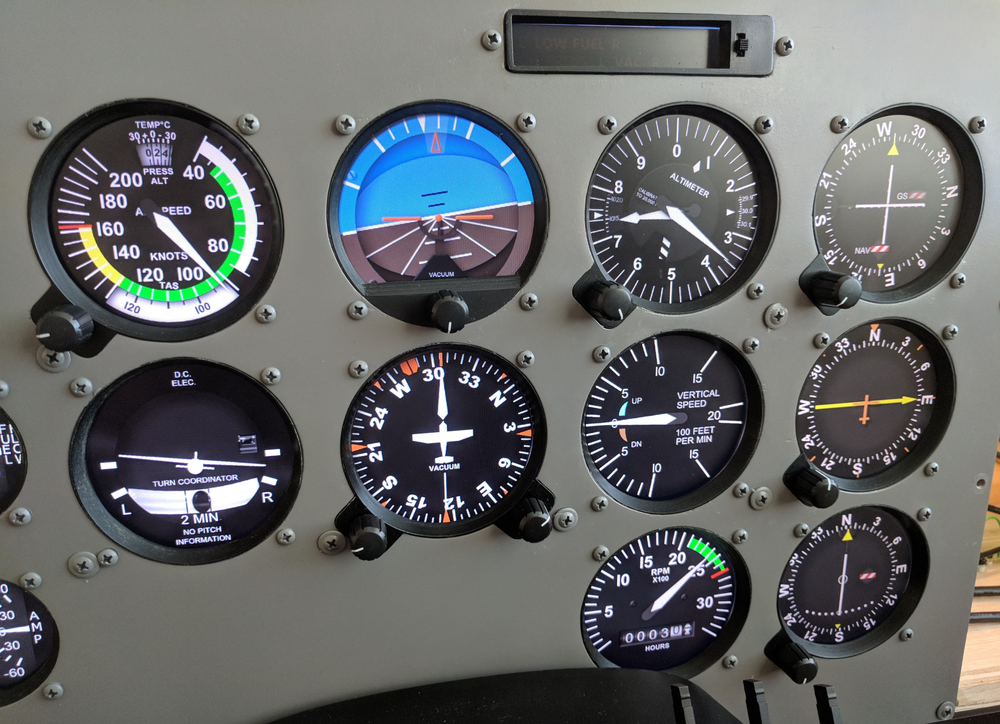

# Instrument Panel

The instrument panel simulates the typical setup in a steam gauge Cessna 172.

## Panel

The instrument panel is constructed from painted 1/4" inch birch plywood with cutouts for mounting instrument bezels and hardware. All parts for the panel are designed to fit into the depth of the panel.

Channels are routed into the panel for wiring the instruments to a terminal block that [connects to an Arduino Mega](../io) through a slot cut into left side the [frame](../frame).

## Instrument Bezels

The instrument bezels provide a clean way for framing the 2d instruments that are rendered on the LCD (via [Air Manager](https://www.siminnovations.com/)) and provide a means for securely mounting rotary encoders into the panel.

There are models for each bezel type (`bezel_large.FCStd`, `bezel_small.FCStd`, `bezel_annunciator.FCStd`) and components in each model can be toggled on/off to produce STL files for all of the required instruments.

### Large Instruments (3 1/2")

`bezel_large.stl` (tachometer, turn and balance indicator)

`bezel_large_single_encoder.stl` (airspeed indicator, altimeter, vsi, vor, adf)

`bezel_large_dual_encoder.stl` (gyro compass)

`bezel_large_attitude.stl` (attitude indicator)

### Small Instruments (2 1/4")

`bezel_small.stl` (vacuum/ammeter, fuel quantity, engine temp/press.)

`bezel_small_egt.stl` (egt/fuel flow)

`bezel_small_clock.stl` (clock)

`bezel_small_clock_button.stl` (clock buttons)

### Annunciators

`bezel_annunciator.stl` (annunciators)

## Parts List

| Component                          | Part                                     | Quantity  | Source                 |
| ---------------------------------- | ---------------------------------------- | --------- | ---------------------- |
| Panel                              | 1/4" birch plywood                       | 14" x 24" |                        |
| Screws (for attaching instruments) | \#6-32 x 1/4" Phillips Pan Head Screws   | 55        | http://amzn.to/2yMTstO |
| Screws (for attaching panel)       | \#8 x 3/4" Phillips Truss Head Screws    | 12        | http://amzn.to/2zjDXx6 |
| Encoders                           | Low-profile rotary encoders, 6mm shaft   | 9         | http://amzn.to/2BmVPXe |
| Buttons (for clock)                | Tactile push buttons (6x6x4.3mm)         | 3         | http://amzn.to/2kC8qxS |
| Annunciator switch                 | 3 position 2P3T Micro Right Angle Slide Switch | 1         | http://amzn.to/2kFSRVM |

