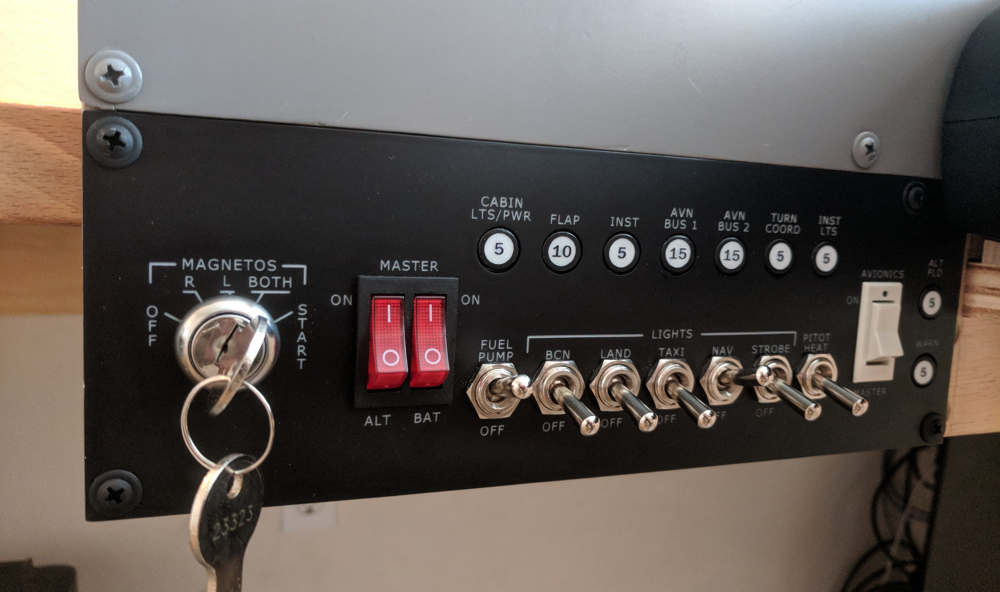
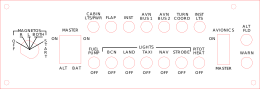
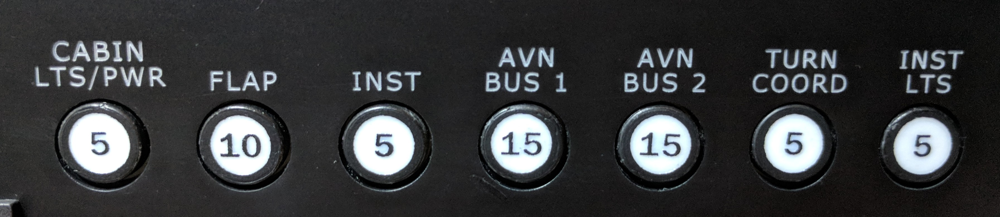

# Switch Panel

The switch panel simulates a typical setup in a steam gauge Cessna 172. The panel houses a custom-built spring-return [key switch](#key-switch), simulated [fuses](#fuses), and toggle switches for the electrical buses, fuel pump, lighting, pitot heat, and avionics.

 The panel is attached directly to the [frame](../frame) with pan-head screws.

## Panel

The panel is laser cut from white acrylic, painted black, and then laser engraved.

`switch_panel.svg`

## Key Switch

A 5-position, spring-action key switch is mounted into the panel. See [key switch](./key_switch) for build details.

## Fuses

DPDT buttons with 3d-printed caps are mounted into the panel to simulate resettable fuses. See [fuses](./fuses) for build details.

## Parts List

| Component                        | Part                            | Quantity | Source                                   |
| -------------------------------- | ------------------------------- | -------- | ---------------------------------------- |
| Panel                            | 3/16" bright white cast acrylic | 260x89mm | https://www.ebay.com/itm/3-16-7328-Translucent-Bright-White-Cell-Cast-Acrylic-Sheet-12-x-24/291827088484 |
| Alternator/Battery Master Switch | Dual rocker switch              | 1        | http://www.desktopaviator.com/Products/parts.htm |
| Fuel Pump, Lights, Pitot Heat    | SPDT Toggle Switch              | 7        | http://www.desktopaviator.com/Products/parts.htm |
| Avionics Master Switch           | On/Off Rocker Switch            | 1        | http://www.desktopaviator.com/Products/parts.htm |

