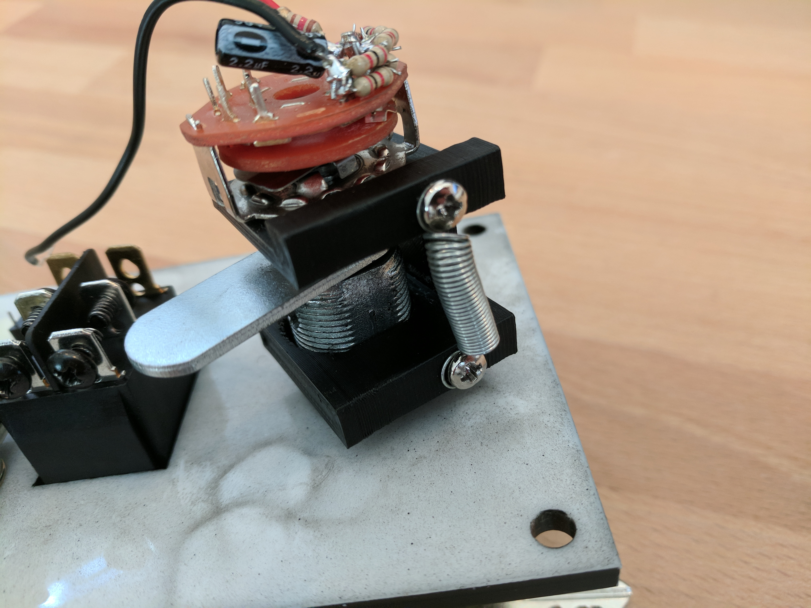

# 5 Position Spring-Return Key Switch

This key switch simulates the 5 positions on a standard Cessna 172 ignition switch (off, mag right, mag left, both, and start) and provides a spring return from the start position.

The switch is assembled from a 3d printed mount, a filing cabinet lock, and a 5 position rotary switch. 

## Assembly

The components of the key switch are mounted into a 3d printed mount that allows a cabinet lock to be attached to a rotary switch and the cabinet lock arm to engage a spring when moved into the start position.

`key_switch.stl` (https://www.thingiverse.com/thing:2687594)

The rotary encoder is mounted into the small hole and the cabinet lock is pressed through the panel and into the large hole.

Some modifications must be made to the cabinet lock to allow the shaft of the rotary encoder to be securely attached:

1. Drill out the screw hole in the cabinet lock body to allow the shaft of the rotary encoder to be inserted snugly into the body of the lock. A washer or two may be needed to ensure the bar on the cabinet lock is securely fitted over the square mount on the cabinet lock body.
2. Drill a hole in the side of the cabinet lock body and tap it to allow a hex set screw to be secured against the rotary encoder shaft. A hole must also be made in the cabinet lock barrel to allow access to the set screw
3. Remove the rotational stop from the cabinet lock barrel. This design uses the stops of the rotary switch instead.

The key switch when assembled and mounted into the panel:

For wiring details, see http://www.simvim.com/ardsimx/inputs/rotary_a.png. I used parallel 2k resistors as I did not have any 1k resistors in my parts bin.

## Parts List

| Component                | Part                            | Quantity | Source                 |
| ------------------------ | ------------------------------- | -------- | ---------------------- |
| Cabinet lock             | Drawer & Cabinet Lock, 1-1/8 in | 1        | http://amzn.to/2yQJZlz |
| Spring                   | Extension Spring, 7/32" x 1"    | 1        | http://amzn.to/2BzLGct |
| Spring mounting screws   | Round head screw, #6-32 1/4"    | 2        | http://amzn.to/2yMTstO |
| 5 position Rotary switch | Panel Mount 2P5T Rotary Switch  | 7        | http://ebay.to/2B5hJS6 |
| Hex head set screw       | Hex Head Set Screw              | 1        | http://amzn.to/2BB8ubD |