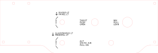

# Throttle and Mixture Panel

The throttle and mixture panel houses real Cessna 172 throttle and mixture controls, lighting rheostats, and the alt static air switch.

The panel is attached directly to the frame with truss-head screws.

## Panel

The panel is laser cut from white acrylic, painted black, and then laser engraved.

`throttle_mixture_panel.svg`

## Light Dimming Rheostat Knobs

The panel lighting rheostat knobs are 3d-printed and mounted on dual-concentric linear potentiometers.

### Inner Knob

`rheostat_knob_inner.stl`

### Outer Knob

`rheostat_knob_outer.stl`

## Parts List

| Component        | Part                                 | Quantity  | Source                                   |
| ---------------- | ------------------------------------ | --------- | ---------------------------------------- |
| Panel            | 3/16" bright white cast acrylic      | 310x104mm | http://ebay.to/2Bn1CMs                   |
| Rheostat         | Dual-concentric linear potentiometer | 2         | http://amzn.to/2CNa5ZA                   |
| Throttle Control | A-820 FRICTION LOCK CONTROL          | 1         | https://www.aircraftspruce.com/catalog/appages/a820.php |
| Mixture Control  | A-790 VERNIER CONTROL - RED          | 1         | https://www.aircraftspruce.com/catalog/appages/a7902.php |
| Alt Static Air   | Chrome Push/Pull Switch              | 1         | http://www.desktopaviator.com/Products/parts.htm |